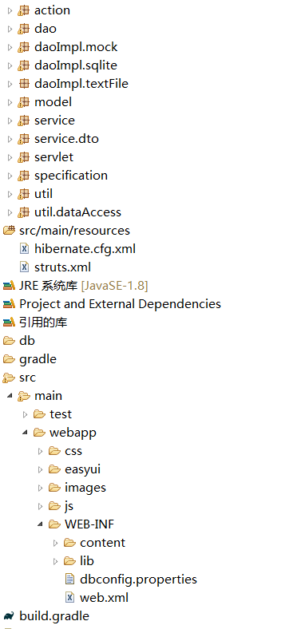
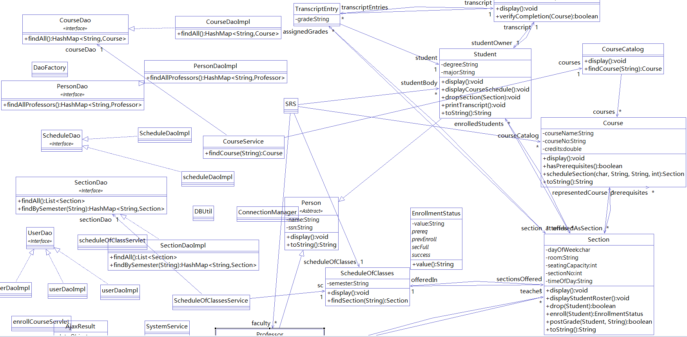
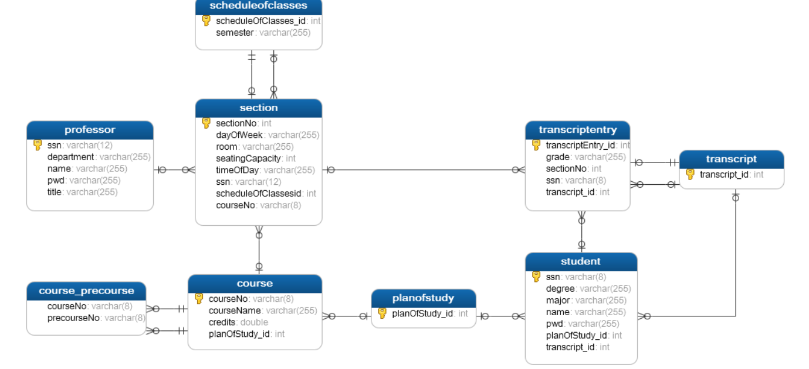

<<<<<<< HEAD
#finalproject
##系统分层

##测试

##系统类图

##数据库结构图

###登陆截图

###查看课表截图

###选课时序图

###选课截图

###查看成绩单时序

##规约

##工厂

###注
初期将项目改为gradle添加的strtus，
后来发现通过jdbc连接查询只能返回字符，不能直接返回和与其联系的数据，所以又添加了orm框架，
通过注解生成数据库之后没有外键关联但是用hibernate返回实体与其关联实体（不知道为啥不能实体中的List<实体>不能自动查询总是报no   session的错误，现在也搞不清楚，只能通过再建立查询后赋值，但这样太麻烦间），也是因为以前都是直接用ssh框架，对hibernate不是很熟悉，所以在实体上浪费了很长时间，部分功能也没有实现。
=======
# final
>>>>>>> origin/master
